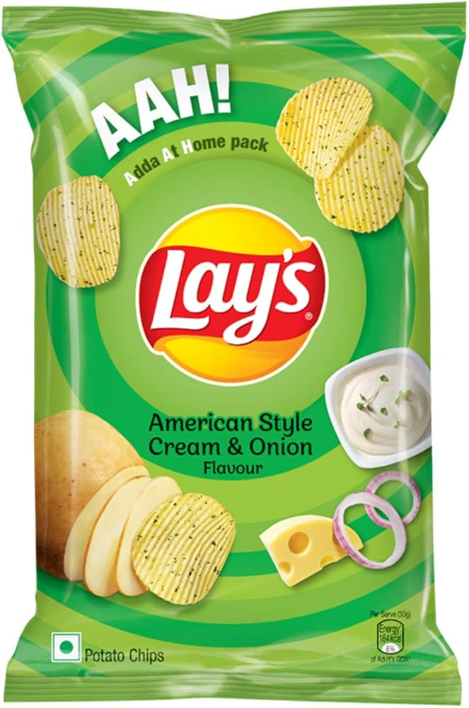
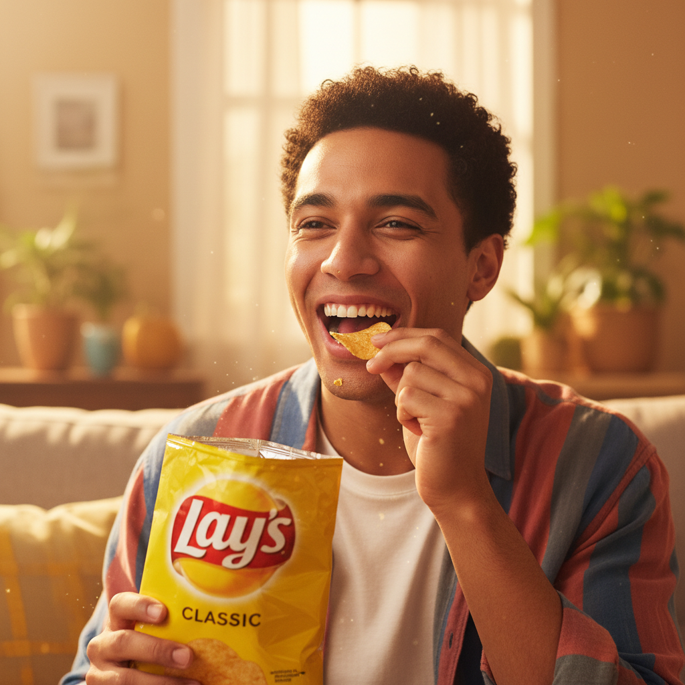

A premium, AI-powered social media content generator that orchestrates **Gemini 2.0 Flash** (for text) and **Fal.ai** (for high-quality media) to create optimized posts for X and TikTok
=======


## 🚀 Features

-   **Multi-Platform Support**: Tailored content for X (Twitter) and TikTok 
-   **Intent-Driven Generation**: Choose from Organic, Paid Ads, Educational, or Conversion-focused strategies.
-   **Advanced Media Generation**:
    -   **Images**: High-resolution, style-consistent images via Fal.ai (Flux/SDXL).
    -   **Videos**: Short-form video generation using Fal.ai (Minimax/Runway).
    -   **Carousels**: Multi-slide visual storytelling for TikTok.
-   **LangGraph Orchestration**: A stateful multi-agent workflow (Planner → Prompt Engineer → Copywriter → Visual Refiner → Media Producer).
-   **Modern Web Interface**: A sleek, dark-mode UI with glassmorphism effects for seamless interaction.
-   **Style Transfer**: Upload reference images to guide the visual aesthetic.

## � Screenshots

### Web Interface


### Generated Post
#### Input

#### Text: Ever notice how a perfect crunch makes things funnier? That's the Lay's effect. It's not just a snack, it's an audible spark turning ordinary moments into pure joy. Get crunching! 😂 #Lays

#### Output



## 🛠️ Architecture

The system is built on a robust stack:

-   **Backend**: FastAPI (Python)
-   **Frontend**: Vanilla JS, HTML5, CSS3 (Modern Glassmorphism Design)
-   **AI Orchestration**: LangGraph
-   **LLM**: Google Gemini 2.0 Flash
-   **Media Models**: Fal.ai (Nano banana, veo3)
  
## 📦 Installation

1.  **Clone the repository**:
    ```bash
    git clone https://github.com/Tasneem14/Ad_Post_Agent.git
    cd Ad_Post_Agent
    ```

2.  **Create a virtual environment** (optional but recommended):
    ```bash
    python -m venv venv
    source venv/bin/activate  # On Windows: venv\Scripts\activate
    ```

3.  **Install dependencies**:
    ```bash
    pip install fastapi uvicorn python-multipart google-genai fal-client langgraph jinja2
    ```

4.  **Set up Environment Variables**:
    You need API keys for Google Gemini and Fal.ai. Set them in your environment or create a `.env` file (if you add `python-dotenv`):

    ```bash
    # Windows PowerShell
    $env:GEMINI_API_KEY="your_gemini_key"
    $env:FAL_KEY="your_fal_key"
    ```

## 🏃‍♂️ Usage

1.  **Start the Server**:
    ```bash
    python -m uvicorn main:app --reload --port 8000
    ```

2.  **Open the Web Interface**:
    Navigate to `http://localhost:8000` in your browser.

3.  **Generate Content**:
    -   Select your **Platform** and **Intent**.
    -   Describe your **Content Idea**.
    -   (Optional) Upload a **Reference Image** for style consistency.
    -   Click **Initialize Agent**.

4.  **View Results**:
    -   The agency will display the generated copy and media side-by-side.
    -   Check the **Agent Logs** tab to see the internal thought process of the agents.

## 📂 Project Structure

```
├── main.py                     # FastAPI entry point
├── content_orchestrationfal.py # LangGraph agent logic & tool definitions
├── platform_rules_config.json  # Configuration for platform-specific rules
├── static/                     # Frontend assets
│   ├── index.html              # Web interface
│   ├── style.css               # Styling
│   └── script.js               # Client-side logic
└── README.md                   # Project documentation
```


## 📄 License

This project is licensed under the MIT License.
